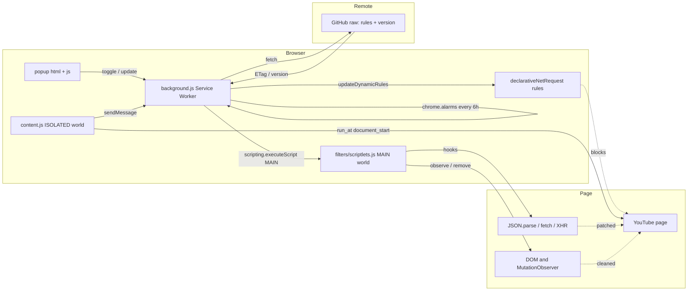
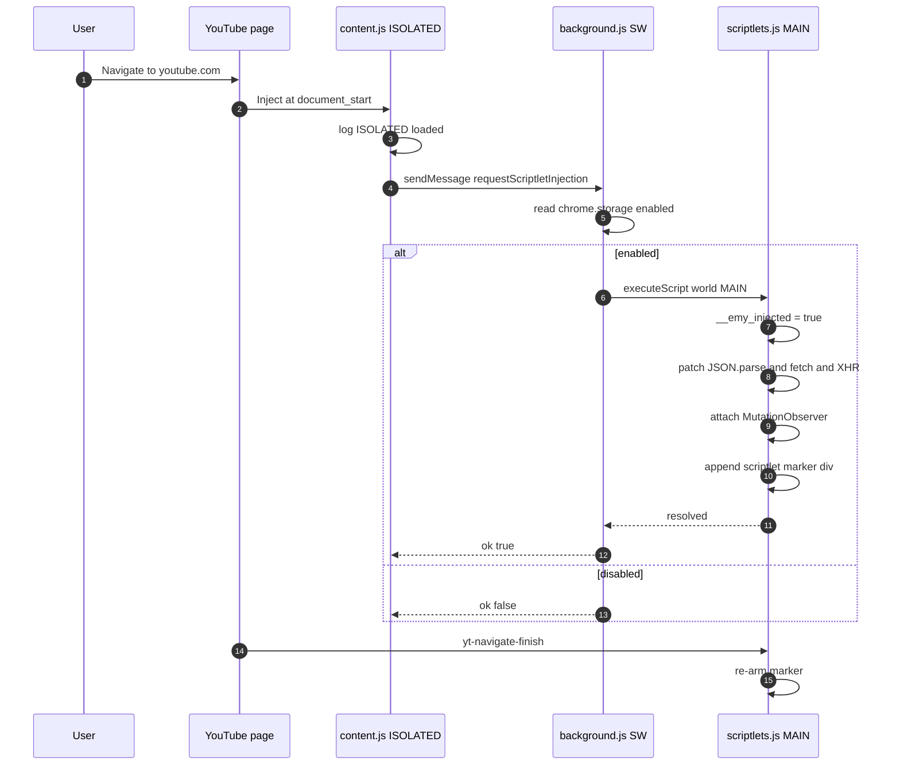
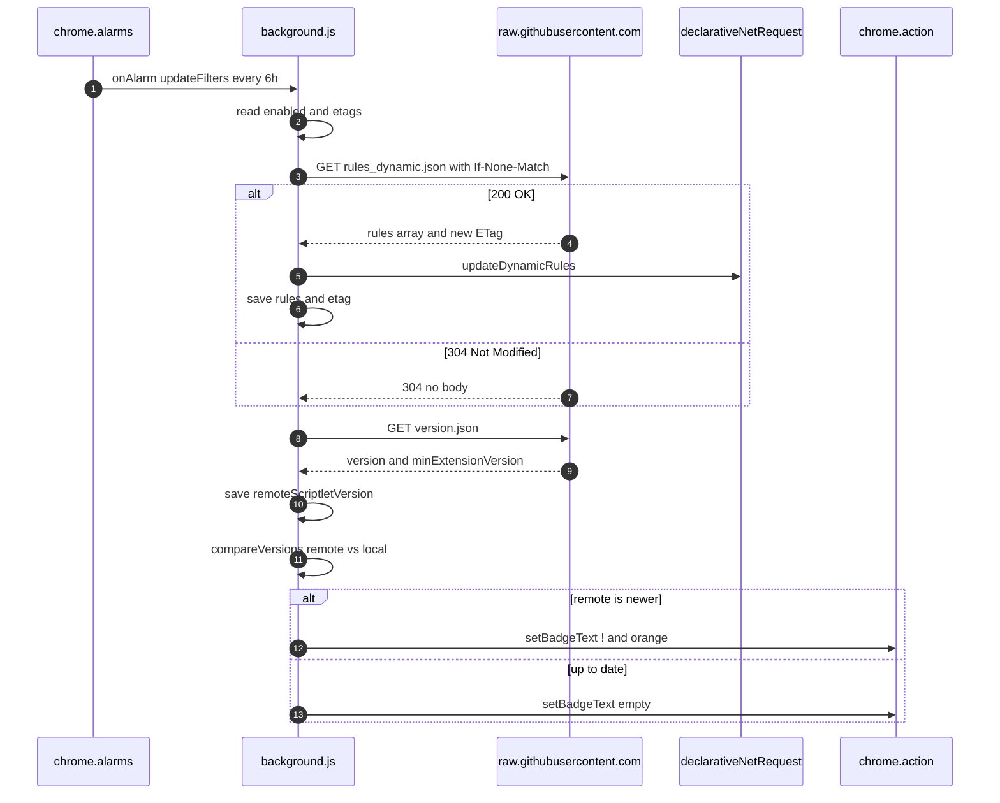

# Emy

> Hi, I'm Antonio, an Italian developer. I built Emy because I was tired of
> adblocker detection banners on YouTube and I wanted something small, fast
> and silent — not a 3 MB extension with 200k users phoning home.
> Emy does one thing: it blocks YouTube ads **without telling YouTube**.

A lightweight, **Manifest V3** Chrome / Edge / Brave extension that silently
blocks YouTube ads and bypasses the current anti‑adblock detection systems.
It works by combining **declarative network rules** (DNR) with a small
**MAIN‑world scriptlet** that rewrites the JSON payloads, hooks `fetch` /
`XMLHttpRequest`, removes ad overlays via a `MutationObserver`, and
auto‑skips or accelerates unskippable ads.

---

## Table of contents

1. [Badges](#badges)
2. [Highlights](#highlights)
3. [How silent blocking works](#how-silent-blocking-works)
4. [Architecture](#architecture)
5. [Repository layout](#repository-layout)
6. [Pros and cons](#pros-and-cons)
7. [Installation](#installation)
8. [Updating the rules remotely](#updating-the-rules-remotely)
9. [Versioning & the orange badge](#versioning--the-orange-badge)
10. [Debugging](#debugging)
11. [Inspiration and references](#inspiration-and-references)
12. [Contributing](#contributing)
13. [License](#license)
14. [Credits](#credits)

---

## Badges

<p>
  
  
  
  
  
  
  
  
  
</p>

---

## Highlights

- **Silent** — no UI nag, no detection banner, no "adblock detected" wall.
- **Tiny** — well under 50 KB of source. The whole thing loads in < 5 ms.
- **Manifest V3 native** — no `background.pages`, no remote‑loaded code.
- **Two‑layer defence** — static + dynamic `declarativeNetRequest` for
  network blocking, and a `MAIN`‑world scriptlet for in‑page patching.
- **SPA‑aware** — re‑injects itself on every YouTube `yt-navigate-finish`.
- **Self‑updating DNR rules** — the only network call goes to your own
  GitHub raw URL. The extension itself is fully self‑contained.
- **Honest about limitations** — see the [Pros and cons](#pros-and-cons)
  section below.

---

## How silent blocking works

> This section is the technical core of the README. If you only want to
> install the extension, jump to [Installation](#installation).

YouTube's anti‑adblock stack has three layers, and Emy has one trick for
each one.

### 1. Content Security Policy (CSP)

`https://www.youtube.com` ships a strict CSP that disallows inline `<script>`
tags, `eval`, and most `data:` scripts. That is **why** Emy does **not**
use `chrome.tabs.executeScript({ code: ... })` or any DOM‑injected
`<script>` element. Both would be silently dropped by the browser.

Instead, Emy ships the scriptlet as a **packaged file**
(`filters/scriptlets.js`) and injects it with:

```js
chrome.scripting.executeScript({
  target: { tabId: sender.tab.id },
  files: ['filters/scriptlets.js'],
  world: 'MAIN'        // <-- the key parameter
});
```

Because the script is a packaged MV3 resource, it is **not** subject to
the page's CSP. It is injected as if it were part of the page itself,
running synchronously in the same realm as YouTube's JavaScript.

### 2. ISOLATED world vs MAIN world

Chrome extensions have two JavaScript contexts per page:

| Context                | Can read page's globals? | Can use `chrome.*` APIs? | Typical use                                  |
|------------------------|--------------------------|--------------------------|----------------------------------------------|
| **ISOLATED** (default) | ❌                       | ✅                       | `content.js` — bridge, messaging, storage.   |
| **MAIN**               | ✅                       | ❌                       | `scriptlets.js` — hooks, DOM, JSON.parse.    |

If you try to monkey‑patch `JSON.parse` from the ISOLATED world, you are
patching a *copy* of the global object; the page's own code still sees the
native one. YouTube's ad player would happily keep parsing the un‑stripped
ad payload.

That's why Emy has **two files**:

- `content.js` — runs in the **ISOLATED** world. Has access to
  `chrome.runtime.sendMessage`, so it asks the background to do the actual
  injection.
- `scriptlets.js` — runs in the **MAIN** world. Replaces `JSON.parse`,
  `window.fetch`, `XMLHttpRequest.prototype.open` / `.send`, attaches a
  `MutationObserver`, and exposes `window.__emy_debug`.

### 3. Anti‑detection details

YouTube (and the AntiAdblock scripts) frequently probe the global
environment to look for tell‑tale signs of tampering:

- `Function.prototype.toString.call(JSON.parse)` returning the source of
  the monkey‑patched function.
- `fetch.toString()` returning the patched source.
- A `__adblock` / `__emy_…` symbol leaking into the global scope.

Emy counters each:

- `JSON.parse.toString` and `window.fetch.toString` are reset to the
  standard `function parse() { [native code] }` string, fooling
  `toString`‑based fingerprinting.
- Hooks are only attached once (`window.__emy_injected` guard).
- The only exposed helper is `window.__emy_debug` (intentional, opt‑in).

### 4. The four blocking strategies in `scriptlets.js`

| # | Strategy                          | Target                                                  | Why it works                                                                       |
|---|-----------------------------------|---------------------------------------------------------|------------------------------------------------------------------------------------|
| 1 | `JSON.parse` recursive strip      | The huge ad payload embedded in `ytInitialPlayerResponse` | Strips every key under `AD_KEYS` (adPlacements, playerAds, adBreakHeartbeatParams…) **before** YouTube's player ever sees it. |
| 2 | `window.fetch` hook               | Telemetry & ad‑creative requests                        | Returns a synthetic `200 {}` to keep the page's promise chain happy.               |
| 3 | `XMLHttpRequest` `open` / `send` hook | Legacy ad beacons (`ptracking`, `/api/stats/ads`)   | Same idea: synthesises an empty response, dispatches `load`, and never goes to network. |
| 4 | `MutationObserver` + 2 s fallback | DOM overlays & skip buttons                              | Removes `.ytp-ad-overlay-container`, `ytd-ad-slot-renderer`, `ytd-enforcement-message-view-model`, etc., and *clicks* the skip button the moment it appears. For non‑skippable ads it sets `playbackRate = 16`, mutes the video, and jumps `currentTime` to the end. |

Layered together, the four strategies mean there is no single point of
failure: even if YouTube ships a new obfuscated key name, the `fetch` /
`XHR` / DOM layers still catch the ad. And even if those are bypassed,
the DNS‑level `declarativeNetRequest` rules stop the ad request before it
ever leaves the browser.

---

## Architecture

### General architecture



### Scriptlet injection flow



### Dynamic-rule update flow



---

## Repository layout

```
Emy/
├── manifest.json              # MV3 manifest: permissions, content script, action, icons
├── background.js              # Service worker: DNR, alarms, version check, message router
├── content.js                 # ISOLATED-world bridge; asks BG to inject the scriptlet
├── filters/
│   ├── rules_static.json      # Static DNR rules (bundled with the extension)
│   ├── rules_dynamic.json     # Fallback dynamic DNR rules (usually empty)
│   ├── scriptlets.js          # MAIN-world anti-adblock logic
│   └── version.json           # Sample remote-version manifest
├── lib/
│   └── storage-utils.js       # Tiny helper around chrome.storage.local + addDebugLog
├── popup/
│   ├── popup.html             # Toggle, status box, update button, debug log
│   ├── popup.css              # Dark theme, 280 px wide, no dependencies
│   └── popup.js               # Popup logic, getStatus, checkScriptlet
├── icons/
│   ├── icon16.png
│   ├── icon32.png
│   ├── icon48.png
│   ├── icon64.png
│   └── icon128.png
├── CHANGELOG.md
├── CONTRIBUTING.md
├── LICENSE                    # MIT, 2026, Antonio
└── README.md                  # you are here
```

### What each file does

- **`manifest.json`** — declares MV3, the `declarativeNetRequest`,
  `scripting`, `storage`, `alarms`, `tabs` permissions, the
  `https://raw.githubusercontent.com/*` host permission (so the background
  can fetch updates), the YouTube content script (`document_start`), and
  the popup.
- **`background.js`** — owns the service worker. It applies the static +
  dynamic DNR rules, schedules an alarm every 6 hours to refetch them,
  checks `version.json` and sets the orange badge, injects `scriptlets.js`
  on demand, and routes messages from the popup and content script.
- **`content.js`** — runs at `document_start` in the **ISOLATED** world.
  Sends a single `requestScriptletInjection` message to the background and
  also re‑requests injection on YouTube's `yt-navigate-finish` event and
  on `popstate`, so SPA navigation doesn't slip through. Also handles
  `disableScriptlet` (sent by the background on toggle‑off) and bridges it
  to the MAIN world.
- **`filters/scriptlets.js`** — runs in the **MAIN** world. Patches
  `JSON.parse` (recursively strips ad keys), `window.fetch` (returns an
  empty `200 {}` for ad URLs), `XMLHttpRequest.open`/`send` (synthesises an
  empty response), attaches a throttled `MutationObserver` that removes
  ad overlays and clicks the skip button the moment it appears, and for
  non‑skippable ads speeds the video up to 16×, mutes it, and seeks to
  the end. Exposes `window.__emy_debug()`.
- **`filters/rules_static.json`** — 10 hand‑curated `declarativeNetRequest`
  block rules for the most common ad endpoints (doubleclick,
  googlesyndication, googleadservices, pagead/, ptracking, etc.). Loaded
  on install and never changes unless the extension is republished.
- **`filters/rules_dynamic.json`** — the fallback "shipped empty" file.
  The background tries the GitHub raw URL first; this file is only used
  if the network call fails. You can also commit hot‑fix rules here for
  users running an old build.
- **`filters/version.json`** — *the* file that drives the orange badge.
  Hosted on GitHub raw. Contains the current scriptlet `version` and the
  minimum required extension version. The background compares
  `remote > local` and flips the badge to `!` with the orange colour
  `#ff8c00`.
- **`lib/storage-utils.js`** — `getStorage`, `setStorage`, `addDebugLog`
  (ring buffer of 100 lines). Shared by the background script.
- **`popup/popup.{html,css,js}`** — 280 px dark popup with: enable toggle,
  status box (local vs remote scriptlet version), orange update banner
  when outdated, manual "Update filters" button, debug log viewer, and
  a "Check scriptlet" button that introspects the active YouTube tab.

---

## Pros and cons

### Pros

- **Effective against current anti‑adblock.** YouTube's player
  introspects its own JSON payload before showing the ad; stripping
  `adPlacements` and friends at `JSON.parse` time prevents the ad slot
  from ever being created.
- **Lightweight.** The whole extension is well under 50 KB. No bundlers,
  no frameworks, no analytics.
- **Silent.** No "adblock detected" banner, no nag, no "please disable
  your adblocker" page.
- **MV3‑native.** No `background.pages`, no remote code, no `eval`.
  It is one of the few extensions that works in 2026+ Chromium without
  workarounds.
- **Self‑updating rules.** Only the declarative rules can be updated
  without a store review; the *scriptlet* itself can be repackaged and
  pushed to the store on demand.
- **Privacy‑respectful.** The only network call goes to your own
  public GitHub raw URL (configurable in `background.js`). There is
  no telemetry, no user ID, no usage ping.

### Cons / limitations

- **Scriptlet updates require a new store release.** The scriptlet
  runs in the MAIN world, so a critical bug fix still needs a manifest
  version bump and a Chrome Web Store review.
- **CSP still blocks remote scriptlet loading.** We can update the
  network rules automatically, but not the in‑page patching logic.
- **SSAI (Server‑Side Ad Insertion) is out of scope.** When the ad is
  baked into the manifest URL itself (e.g. on some live streams and on
  most TV/embedded players) there is no client‑side payload to strip.
- **YouTube is a moving target.** When YouTube renames a key in their
  JSON, we have to push an update. The orange badge is your signal
  that the scriptlet is behind.
- **YouTube-only.** Emy is intentionally narrow. There is no
  EasyList / EasyPrivacy import, no cosmetic filter language, no
  element‑zapper, no cookie blocker. Use uBlock Origin alongside if
  you need a general‑purpose blocker.
- **Hardcoded GitHub owner/repo in `background.js`.** You have to
  edit `GITHUB_OWNER` / `GITHUB_REPO` before you ship, or you will
  be calling the example URL.

---

## Installation

### For users (sideload / Chrome Web Store)

> The Chrome Web Store listing is **not** published yet; the badge
> above is a placeholder. Until then, you can sideload the unpacked
> extension.

1. Download the latest release from the
   [Releases page](https://github.com/anto0102/Emy/releases) (or clone
   this repo).
2. Open `chrome://extensions` (or `edge://extensions` / `brave://extensions`).
3. Toggle **Developer mode** on (top‑right).
4. Click **Load unpacked** and select the project folder.
5. Pin the **Emy** icon to the toolbar. Click it to verify the popup
   shows `Active`.

### For developers

```bash
git clone https://github.com/anto0102/Emy.git
cd Emy
```

Then load the folder as an **unpacked extension** (see step 4 above).
After editing any file under `background.js`, `content.js`, or
`filters/scriptlets.js`, click the **Reload** icon on the extension
card. The popup's **Check scriptlet** button lets you verify the
MAIN-world injection worked.

### Editing the GitHub filters URL

Open `background.js` and change:

```js
const GITHUB_OWNER  = 'anto0102';
const GITHUB_REPO   = 'emy-filters';
const GITHUB_BRANCH = 'main';
```

If you don't want any network updates, leave them pointing at a
non‑existent repo — the extension will silently keep using the bundled
`rules_dynamic.json`.

---

## Updating the rules remotely

The only file Emy fetches over the network is
`rules_dynamic.json` (and a tiny `version.json` for the orange badge).
You can host both on any **public** GitHub repository (a fork of this
one works perfectly) and they will be served as
`https://raw.githubusercontent.com/<owner>/<repo>/<branch>/<file>`.

### Step 1 — Create a public repo

1. Create a new GitHub repository, e.g. `https://github.com/anto0102/emy-filters`.
2. It only needs to be **public** (raw.githubusercontent.com refuses
   private repos for unauthenticated requests).

### Step 2 — Add `rules_dynamic.json`

The file is a plain JSON array of `declarativeNetRequest` rules. Each
rule needs a **unique numeric `id`**, a `priority`, an `action`, and a
`condition`. Example:

```json
[
  {
    "id": 1001,
    "priority": 1,
    "action": { "type": "block" },
    "condition": {
      "urlFilter": "||new-ad-endpoint.example",
      "resourceTypes": ["script", "xmlhttprequest"]
    }
  }
]
```

Chrome's limits apply: at most **30000** dynamic rules, IDs must be
positive integers, and the file must be a flat array. Refer to the
[`declarativeNetRequest` documentation](https://developer.chrome.com/docs/extensions/reference/api/declarativeNetRequest)
for the full schema.

### Step 3 — Add `version.json`

```json
{
  "version": "2.1.0",
  "minExtensionVersion": "1.1.0",
  "updatedAt": "2026-07-09T12:00:00Z",
  "message": "Hot-fix for new YouTube ad key.",
  "changelogUrl": "https://github.com/anto0102/Emy/blob/main/CHANGELOG.md"
}
```

The `version` field is the scriptlet version; when it is **higher**
than the one bundled with the user's extension, the badge turns
orange. `minExtensionVersion` is informational — bump the store
listing when you raise it.

### Step 4 — Configure the URL in `background.js`

```js
const GITHUB_OWNER  = 'anto0102';
const GITHUB_REPO   = 'emy-filters';
const GITHUB_BRANCH = 'main';
```

### Step 5 — Commit, push, and wait

The background refetches every 6 hours (configurable via
`ALARM_PERIOD_MINUTES`). You can also click **Update filters** in the
popup to trigger an immediate check.

The background uses HTTP `If-None-Match` with the GitHub `ETag`, so
unnecessary downloads are avoided.

---

## Versioning & the orange badge

There are **two** version numbers in Emy:

| Version    | Where it lives                                       | Meaning                                                                 |
|------------|------------------------------------------------------|-------------------------------------------------------------------------|
| Extension  | `manifest.json` → `version`                          | MV3 extension version. Bumps when the `manifest.json` is republished.   |
| Scriptlet  | `filters/scriptlets.js` → `SCRIPTLET_VERSION` (also `localScriptletVersion` in storage) | The in-page patching logic. Bumps when ad‑strip logic changes.          |

The remote `version.json` is the *truth*: as soon as a value higher
than the bundled one is published on GitHub, the background compares
them with `compareVersions()` and, if `remote > local`, sets the
action icon badge to `!` on an orange (`#ff8c00`) background.

The popup mirrors this status with an **orange banner**:

> A newer scriptlet (2.2.0) is available. Update the extension.

To clear the badge, the user only has to install the newer extension
build from the store. There is no automatic "hot patch" of the
scriptlet — only the DNR rules can be updated in place.

---

## Debugging

### Popup debug

1. Click the **Emy** icon to open the popup.
2. Tick **Show debug**. The text area shows the last 100
   `chrome.storage.local.debugLogs` entries (timestamped).
3. Click **Check scriptlet** to introspect the active YouTube tab. The
   output includes:
   - `Injected` — is the MAIN-world scriptlet present?
   - `Active` — is its marker `data-active="true"`?
   - `Local ver` / `Main ver` / `Up to date` — version match check.
   - Stats: `JSON stripped`, `fetch blocked`, `XHR blocked`,
     `Ads skipped`, `Overlays removed`.
4. Click **Clear log** to wipe the buffer.

### In-page debug

Open DevTools on any YouTube tab and run:

```js
__emy_debug()
```

It logs a `console.table` of the current stats, prints the scriptlet
version, and tells you whether `JSON.parse`, `fetch`, and
`XMLHttpRequest.open` are still hooked. The marker element
(`#__emy_scriptlet_marker`) is hidden but inspectable:

```js
document.getElementById('__emy_scriptlet_marker').getAttribute('data-stats')
```

### Service-worker logs

Visit `chrome://extensions`, find Emy, and click **Service worker →
Inspect**. The console will show `[Emy]`-prefixed log lines and any
uncaught error from `background.js`.

---

## Inspiration and references

Emy would not exist without the work of these projects and authors:

- **[uBlock Origin](https://github.com/gorhill/uBlock)** by Raymond Hill
  — the gold standard of network‑level blockers. The
  `declarativeNetRequest` rule layout and the "minimal privileged
  extension" philosophy are direct descendants of uBO.
- **[AdGuard](https://github.com/AdguardTeam/AdguardBrowserExtension)**
  — extensive catalogue of scriptlets and anti‑anti‑adblock techniques.
  Several of the JSON keys in `AD_KEYS` and the `fetch` hook shape
  come from AdGuard's `AdGuard Assistant` and `Scriptlets` repos.
- **Chrome's [`declarativeNetRequest`](https://developer.chrome.com/docs/extensions/reference/api/declarativeNetRequest)
  reference** — the API contract Emy is built on.
- **The MDN page on [Content Security Policy](https://developer.mozilla.org/docs/Web/HTTP/CSP)** —
  for the *why* of `chrome.scripting.executeScript({ files: ... })`.

---

## Contributing

See [CONTRIBUTING.md](./CONTRIBUTING.md). Pull requests that add new
ad keys, fix a YouTube anti‑adblock regression, or improve the popup
UI are very welcome.

---

## License

[MIT](./LICENSE) — Copyright © 2026 **Antonio** (a.k.a. *anto0102*).

```
MIT License

Copyright (c) 2026 Antonio (anto0102)

Permission is hereby granted, free of charge, to any person obtaining a copy
of this software and associated documentation files (the "Software"), to deal
in the Software without restriction, ...
```

Full text in [LICENSE](./LICENSE).

---

## Credits

- **Author & maintainer** — Antonio (Italian developer, sole author).
  Built in my free time as a research project into MV3 anti‑adblock
  techniques.
- **Icon set** — derived from the Emy logo, hand‑drawn in Inkscape.
- **You** — for using Emy and, hopefully, opening an issue when an
  ad sneaks through.

> *Made eating pizza in Italy.* 🇮🇹🍕
